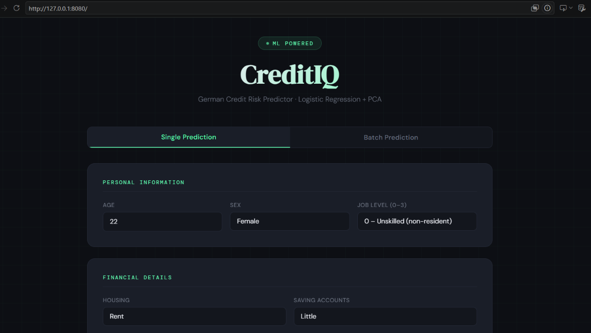
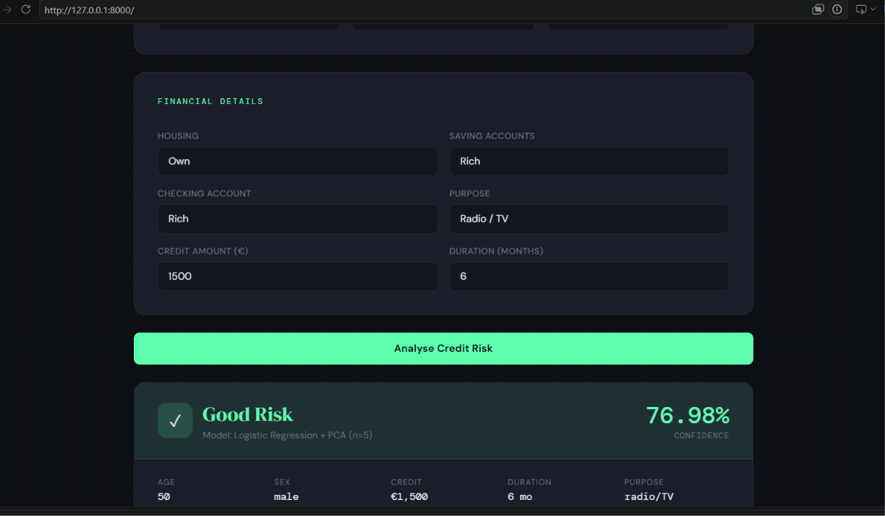
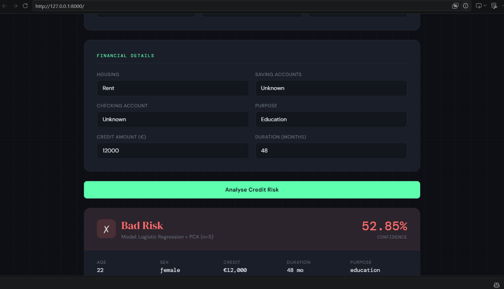
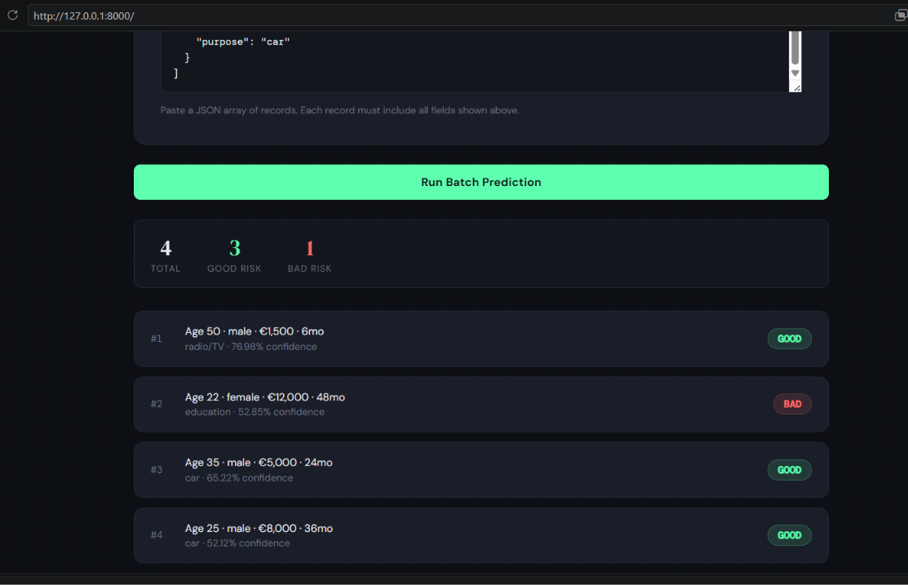

# CreditIQ — Credit Risk Predictor

A machine learning web application that predicts **credit risk as Good or Bad** based on customer financial and personal information.

The project combines a **Logistic Regression classifier with PCA dimensionality reduction** and exposes the trained model through a **FastAPI backend** with a responsive web interface. It supports both individual and batch credit-risk predictions.

---

## 1. Project Overview

**CreditIQ** is a credit risk prediction application built using the German Credit dataset.

The application accepts customer information such as age, job level, housing status, savings, checking account status, credit amount, loan duration, and credit purpose. The input is transformed using the same preprocessing pipeline used during model development and passed through a trained **Logistic Regression + PCA** model.

The system returns:

* Credit risk classification — **Good Risk / Bad Risk**
* Prediction confidence
* Summary of the submitted credit information
* Batch predictions for multiple customers

### Problem Solved

Financial institutions need to evaluate the potential risk associated with loan applicants. Manual evaluation can be time-consuming and inconsistent.

This project demonstrates how a machine learning model can be integrated into a web application to provide a fast, consistent, and accessible **credit-risk prediction workflow**.

---

## 2. Features

### Single Credit Prediction

Users can enter an individual customer's:

* Age
* Sex
* Job level
* Housing status
* Saving account status
* Checking account status
* Credit amount
* Loan duration
* Credit purpose

The application then predicts whether the applicant represents **Good Risk** or **Bad Risk**.

### Prediction Confidence

The application calculates a confidence score from the Logistic Regression model's predicted probabilities and displays it with the prediction result.

### Batch Prediction

Multiple customer records can be submitted simultaneously using a JSON array.

The application returns:

* Total records processed
* Number of Good Risk predictions
* Number of Bad Risk predictions
* Individual prediction results
* Confidence for each prediction

### Input Validation

FastAPI/Pydantic validates important inputs such as:

* Age between 18 and 100
* Job level between 0 and 3
* Positive credit amount
* Positive loan duration
* Required customer fields

### Web Interface

The project includes a responsive web interface with:

* Single Prediction tab
* Batch Prediction tab
* Prediction result cards
* Confidence display
* Batch result summary
* Error handling
* Responsive layout

### Health Check

A `/health` endpoint is provided to verify that the API is running.

---

## 3. Tech Stack

| Technology              | Role                                               |
| ----------------------- | -------------------------------------------------- |
| **Python**              | Core programming language                          |
| **FastAPI**             | Backend REST API and request handling              |
| **Uvicorn**             | ASGI server used to run the FastAPI application    |
| **Pydantic**            | Request validation and API schemas                 |
| **Scikit-learn**        | Machine learning model, PCA and preprocessing      |
| **Logistic Regression** | Final binary credit-risk classifier                |
| **PCA**                 | Dimensionality reduction before classification     |
| **StandardScaler**      | Feature scaling before PCA/model inference         |
| **Joblib**              | Loading the trained ML artifacts                   |
| **Pandas**              | Input data transformation and feature construction |
| **NumPy**               | Numerical operations                               |
| **Jinja2**              | HTML template rendering                            |
| **HTML/CSS/JavaScript** | Frontend user interface and API interaction        |

---

## 4. Architecture

The application follows a simple **frontend → API → ML pipeline** architecture.

```text
                   ┌─────────────────────────┐
                   │       User / Browser     │
                   │      CreditIQ UI         │
                   └────────────┬────────────┘
                                │
                         HTTP Request
                                │
                                ▼
                   ┌─────────────────────────┐
                   │       FastAPI API       │
                   │                         │
                   │  POST /predict          │
                   │  POST /predict/batch    │
                   │  GET  /health           │
                   └────────────┬────────────┘
                                │
                                ▼
                   ┌─────────────────────────┐
                   │    Input Processing     │
                   │                         │
                   │ • Label Encoding        │
                   │ • One-Hot Encoding      │
                   │ • Feature Ordering      │
                   └────────────┬────────────┘
                                │
                                ▼
                   ┌─────────────────────────┐
                   │    StandardScaler       │
                   │       (if available)    │
                   └────────────┬────────────┘
                                │
                                ▼
                   ┌─────────────────────────┐
                   │          PCA             │
                   │        n = 5             │
                   └────────────┬────────────┘
                                │
                                ▼
                   ┌─────────────────────────┐
                   │   Logistic Regression   │
                   │      Classifier         │
                   └────────────┬────────────┘
                                │
                       Prediction + Probability
                                │
                                ▼
                   ┌─────────────────────────┐
                   │       JSON Response      │
                   │                         │
                   │ Good / Bad Risk         │
                   │ Confidence              │
                   │ Input Summary            │
                   └─────────────────────────┘
```

### Prediction Pipeline

```text
User Input
    ↓
Pydantic Validation
    ↓
Categorical Encoding
    ↓
Purpose One-Hot Encoding
    ↓
Feature Ordering
    ↓
StandardScaler
    ↓
PCA (5 Components)
    ↓
Logistic Regression
    ↓
Risk Classification + Probability
    ↓
JSON Response
    ↓
Frontend Result Display
```

---

## 5. Project Structure

```text
CapstoneProject_3/
│
├── main.py
├── index.html
├── logistic_model.pkl
├── pca_transform.pkl
├── scaler.pkl
├── requirements.txt
├── README.md
│
├── static/
│   └── ...
│
├── templates/
│   └── index.html
│
└── venv/
```

### Important Files

| File / Folder        | Purpose                                                                  |
| -------------------- | ------------------------------------------------------------------------ |
| `main.py`            | FastAPI application, input validation, preprocessing and model inference |
| `index.html`         | Frontend interface for single and batch predictions                      |
| `logistic_model.pkl` | Trained Logistic Regression model                                        |
| `pca_transform.pkl`  | Saved PCA transformation                                                 |
| `scaler.pkl`         | Saved StandardScaler used during preprocessing                           |
| `requirements.txt`   | Python dependencies required to run the application                      |
| `static/`            | Static frontend assets                                                   |
| `templates/`         | HTML templates served by FastAPI                                         |
| `README.md`          | Project documentation                                                    |
| `venv/`              | Local Python virtual environment; should not be committed to GitHub      |

> **Note:** The `venv/` folder should be excluded from GitHub using `.gitignore`.

---

## 6. Installation & Setup

### Prerequisites

Make sure the following are installed:

* Python 3.10+
* Git
* pip

### 1. Clone the repository

```bash
git clone <YOUR_GITHUB_REPOSITORY_URL>
cd CapstoneProject_3
```

### 2. Create a virtual environment

Windows:

```powershell
python -m venv venv
```

Activate it:

```powershell
venv\Scripts\activate
```

### 3. Install dependencies

```powershell
python -m pip install -r requirements.txt
```

### Recommended `requirements.txt`

Use the version compatible with the current project environment:

```text
fastapi
uvicorn
jinja2
pydantic
joblib
numpy
pandas
scikit-learn==1.7.2
```

The saved machine-learning artifacts were originally associated with scikit-learn 1.8.0, so keeping the training/inference environment aligned is important for reliable model loading.

### 4. Run the application

From the project root:

```powershell
uvicorn main:app --reload
```

The application will be available at:

```text
http://127.0.0.1:8000
```

Open the address in a browser.

### 5. API documentation

FastAPI automatically provides interactive API documentation at:

```text
http://127.0.0.1:8000/docs
```

---

## 7. Usage

### Single Prediction

1. Open the CreditIQ application.
2. Select the **Single Prediction** tab.
3. Enter the applicant's personal and financial information.
4. Click **Analyse Credit Risk**.
5. The application displays:

   * Risk classification
   * Confidence percentage
   * Input summary

Example:

```text
Age: 35
Sex: Male
Job: 2
Housing: Own
Saving Account: Little
Checking Account: Moderate
Credit Amount: 5000
Duration: 24 months
Purpose: Car
```

The model then returns a result similar to:

```text
Good Risk
Confidence: XX.XX%
```

> Prediction results depend on the trained model and preprocessing artifacts included in the repository.

---

### Batch Prediction

The Batch Prediction tab accepts a JSON array.

Example:

```json
[
  {
    "age": 35,
    "sex": "male",
    "job": 2,
    "housing": "own",
    "saving_accounts": "little",
    "checking_account": "moderate",
    "credit_amount": 5000,
    "duration": 24,
    "purpose": "car"
  },
  {
    "age": 22,
    "sex": "female",
    "job": 1,
    "housing": "rent",
    "saving_accounts": "unknown",
    "checking_account": "unknown",
    "credit_amount": 12000,
    "duration": 48,
    "purpose": "education"
  }
]
```

The application processes each record and displays a summary containing the total number of records and Good/Bad Risk predictions.

---

## 8. Screenshots & Demo

### Application Interface



### Good Risk Prediction



### Bad Risk Prediction



### Batch Prediction


```


## 9. API Documentation

The backend exposes three main endpoints.

### `GET /`

Returns the CreditIQ web interface.

**Response:**

```text
HTML page
```

---

### `POST /predict`

Performs a single credit-risk prediction.

#### Request Body

```json
{
  "age": 35,
  "sex": "male",
  "job": 2,
  "housing": "own",
  "saving_accounts": "little",
  "checking_account": "moderate",
  "credit_amount": 5000,
  "duration": 24,
  "purpose": "car"
}
```

#### Response

```json
{
  "risk": "good",
  "risk_label": 1,
  "confidence": 76.5,
  "input_summary": {
    "age": 35,
    "sex": "male",
    "credit_amount": 5000,
    "duration": 24,
    "purpose": "car"
  }
}
```

The exact confidence value depends on the model prediction.

---

### `POST /predict/batch`

Processes multiple credit applications.

#### Request Body

```json
{
  "records": [
    {
      "age": 35,
      "sex": "male",
      "job": 2,
      "housing": "own",
      "saving_accounts": "little",
      "checking_account": "moderate",
      "credit_amount": 5000,
      "duration": 24,
      "purpose": "car"
    }
  ]
}
```

#### Response

```json
{
  "total": 1,
  "predictions": [
    {
      "risk": "good",
      "risk_label": 1,
      "confidence": 76.5,
      "input_summary": {
        "age": 35,
        "sex": "male",
        "credit_amount": 5000,
        "duration": 24,
        "purpose": "car"
      },
      "record_index": 1
    }
  ]
}
```

---

### `GET /health`

Checks whether the API is running.

#### Response

```json
{
  "status": "ok",
  "model": "LogisticRegression + PCA(n=5)"
}
```

### Authentication

The current application does **not implement authentication or authorization**. It is intended as a demonstration/project application rather than a production financial service.

---

## 10. Engineering Decisions

### Logistic Regression

Logistic Regression was selected as the final classification model because the problem is a binary classification task and the model provides class probabilities that can be used to calculate prediction confidence.

### PCA

Principal Component Analysis was incorporated before classification to reduce the feature representation to five principal components.

This creates a compact representation for the classifier, although dimensionality reduction can reduce interpretability because predictions are made from transformed components rather than the original features.

### Saved ML Artifacts

The preprocessing and trained model components are stored separately:

```text
scaler.pkl
pca_transform.pkl
logistic_model.pkl
```

This ensures that inference can reproduce the transformations used during model development instead of retraining the model every time the API starts.

### FastAPI

FastAPI was selected because it provides:

* Structured request validation
* Automatic API documentation
* High-performance ASGI support
* Simple integration with Python machine-learning workflows

### Batch Processing

A separate batch endpoint was implemented instead of requiring users to submit individual requests repeatedly. This allows multiple records to be processed through the same prediction pipeline.

### Trade-off

The current application prioritizes simplicity and demonstration of an end-to-end ML deployment workflow. It does not include production-level authentication, persistent databases, logging infrastructure, model monitoring, or cloud deployment.

---

## 11. Testing

### Manual API Testing

The application was tested through:

* Browser-based frontend interaction
* FastAPI Swagger documentation
* Single prediction requests
* Batch prediction requests
* Health endpoint

### Single Prediction Testing

Different combinations of:

* Age
* Job
* Housing
* Savings
* Checking account
* Credit amount
* Loan duration
* Purpose

were used to verify that the model produced both Good Risk and Bad Risk predictions.

### Batch Testing

Multiple JSON records were submitted through the Batch Prediction interface to verify:

* JSON parsing
* Multiple-record processing
* Individual predictions
* Prediction confidence
* Good/Bad summary counts

### Running the Application

Start the application with:

```powershell
uvicorn main:app --reload
```

Then test the API through:

```text
http://127.0.0.1:8000/docs
```

### Automated Tests

The current project does not yet include a dedicated automated test suite such as `pytest`.

---

## 12. Limitations

* The model is trained on the German Credit dataset and may not generalize to real-world financial institutions or different populations.
* Prediction confidence represents the model's estimated probability, not a guarantee of prediction correctness.
* The current application does not provide explainable-AI techniques such as SHAP or feature-level explanations.
* There is no authentication or authorization.
* There is no database or persistent prediction history.
* There is no production monitoring or model drift detection.
* The current CORS configuration allows all origins and should be restricted in a production deployment.
* The application currently depends on compatible versions of the libraries used to create the saved machine-learning artifacts.

---

## 13. Future Improvements

Potential improvements include:

* Add automated unit and API tests using `pytest`
* Add SHAP/LIME-based prediction explanations
* Add model performance metrics to the application
* Add ROC-AUC, precision, recall and confusion matrix reporting
* Add authentication and role-based access
* Add a database for prediction history
* Add structured application logging
* Add model monitoring and drift detection
* Restrict CORS origins for production
* Containerize the application with Docker
* Deploy the API to a cloud platform
* Add CI/CD using GitHub Actions
* Add model versioning and reproducible training pipelines

---

## 14. Project Status

**Status: Completed — ML inference web application**

The current version demonstrates an end-to-end machine-learning deployment workflow:

```text
Trained ML Model
       ↓
Saved Preprocessing Artifacts
       ↓
FastAPI Backend
       ↓
REST API
       ↓
Web Interface
       ↓
Single / Batch Prediction
       ↓
Risk + Confidence
```

---

## License

This project is intended for educational and portfolio purposes.
